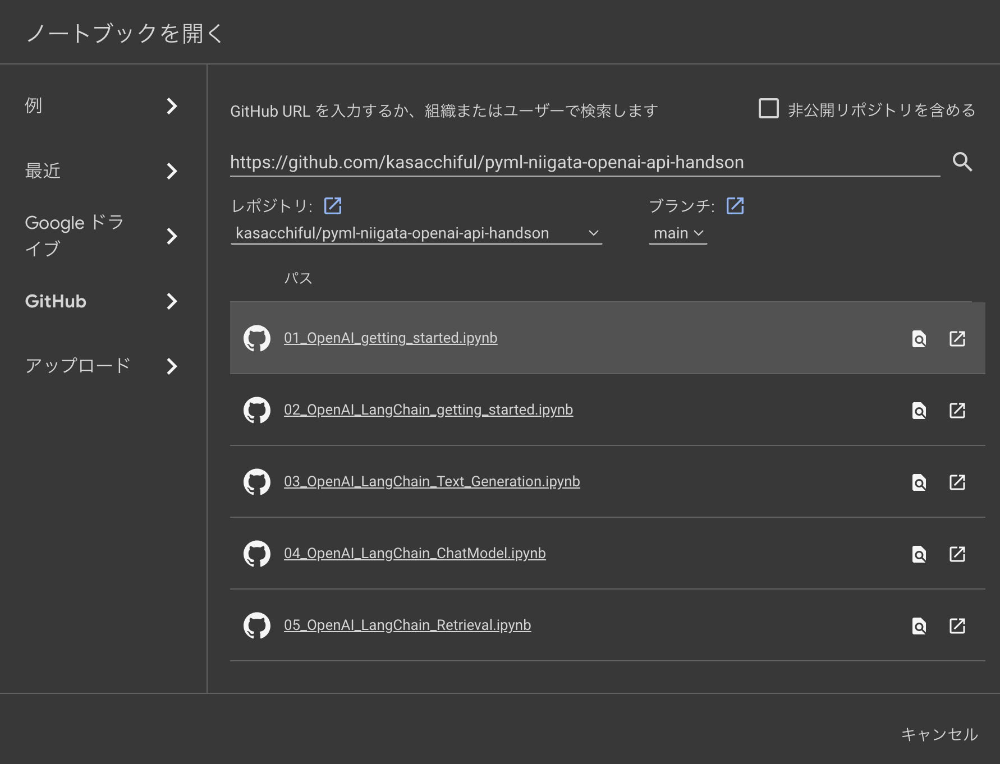

# pyml-niigata-openai-api-handson

2023/11/11 (土)
Python機械学習勉強会in新潟 ハンズオン教材

## 準備

### 1. OpenAI APIキー取得

1. 以下のサイトでログインします。
    - https://platform.openai.com/
2. 左側メニュー「API Keys」をクリックし、API Keysの画面上にある「Create new secret key」をクリックします。
    - APIキーの名前は、任意のわかりやすい名前にしておきます。
3. 作成したAPIキーをコピーしておきます。
    - この後使います。

### 2. openai.env 作成

1. `openai.env.sample` ファイルからコピーして、 `openai.env` ファイルを作成します。
2. ファイルをエディタで修正します。 `<OPENAI APIキー>` の部分に、実際のOpenAIのAPIキー文字列を置き換えてください。

```bash
OPENAI_API_KEY=<OPENAI APIキー>
```

### 3. Google Drive に格納

1. Google Driveにログインします。
2. マイドライブ直下に、 `openai.env` ファイルをアップロードします。

## 利用方法

1. Google Colaboratoryのページを開きます。
    - https://colab.research.google.com/
2. 「ファイル」「ノートブックを開く」をクリックします。
3. GitHubから、このリポジトリの中にあるノートブックファイルを開きます。
    
4. ノートブックを開いた後、「ドライブにコピー」しておくと、Googleドライブに保存されます。
    - 「マイドライブ」「Colab Notebooks」に保存されます。
